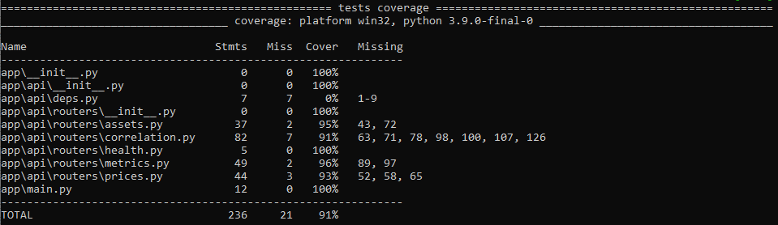

# 📊 Market Data Platform


[](https://github.com/rafael-ribas/market-data-platform/actions/workflows/ci.yml)

[](https://codecov.io/gh/rafael-ribas/market-data-platform)


A production-style **Data Engineering project** that implements a
complete financial market data pipeline.

The system extracts cryptocurrency data from the CoinGecko API, stores
it in PostgreSQL, computes portfolio analytics (returns, volatility,
correlation), and automatically generates HTML and PDF research reports.

------------------------------------------------------------------------

# 📑 Table of Contents

-   [Architecture Overview](#-architecture-overview)
-   [Tech Stack](#-tech-stack)
-   [Data Pipeline Flow](#-data-pipeline-flow)
-   [REST API (FastAPI)](#-rest-api-fastapi)
-   [Docker Deployment](#-docker-deployment)
-   [CI Pipeline](#-ci-pipeline)
-   [Analytics Layer](#-analytics-layer)
-   [Automated Reporting](#-automated-reporting)
-   [Business Impact](#-business-impact)
-   [Quickstart](#-quickstart)
-   [Testing](#-testing)
-   [Roadmap Status](#-roadmap-status)
-   [Repository Structure](#-repository-structure)
-   [Author](#-author)

------------------------------------------------------------------------

# 🧱 Architecture Overview

Pipeline structure:

`API → Extract → Transform → Load → Analytics → Reporting`

Core components:

- Dockerized PostgreSQL database
- Schema versioning with Alembic
- Idempotent upserts (`ON CONFLICT`)
- ETL run tracking (`etl_runs`)
- Data quality validations
- Analytics computation layer
- Automated HTML + PDF report generation
- Production-ready containerized API

------------------------------------------------------------------------

# 🛠 Tech Stack

- Python 3.9+
- PostgreSQL 16
- SQLAlchemy (Core + ORM)
- Psycopg (PostgreSQL driver v3)
- Alembic (Migrations)
- Docker & Docker Compose
- Pandas / NumPy (Analytics)
- Jinja2 (HTML templating)
- Matplotlib (Charts)
- ReportLab (PDF rendering)
- FastAPI
- Ruff (Linting)
- Pytest (Testing)

------------------------------------------------------------------------

# 🔄 Data Pipeline Flow

## 1 - Extract

- Fetch Top N non-stable assets
- Historical price data ingestion
- Rate limit handling
- Resume capability
- Local caching

## 2️ - Transform

- Daily returns
- 30-day cumulative return
- 30-day rolling volatility
- Correlation matrix

## 3️ - Load

- Idempotent upsert into:
  -   `assets`
  -   `prices`
  -   `asset_metrics`
- Execution logging in `etl_runs`

------------------------------------------------------------------------

# 🌐 REST API (FastAPI)

Interactive Documentation: `http://localhost:8000/docs`

## 1 - Health

Returns API status.

`GET /health`

## 2 - Assets

Returns available tracked assets.

`GET /assets\`
`GET /assets/{symbol}`

## 3 - Prices

Returns historical daily prices.

Parameters:

- `start` (optional)
- `end` (optional)
- `limit` (default capped)

`GET /prices/{symbol}?start=YYYY-MM-DD&end=YYYY-MM-DD`

## 4 - Metrics

Returns:

- Daily return
- 30-day cumulative return
- 30-day rolling volatility

`GET /metrics/latest\`
`GET /metrics/{symbol}?window=60`

## 5 - Correlation

Returns:

- Pearson correlation of aligned daily returns
- Number of overlapping observations
- Start and end dates used
- Reference date (`as_of`)

`GET /correlation?asset1=BTC&asset2=ETH&window=60`

------------------------------------------------------------------------

# 🐳 Docker Deployment

The application is fully containerized and can be started using Docker Compose.

## ▶ Start Full Stack (API + PostgreSQL)

```bash
docker compose up --build
```

Services included:

- PostgreSQL 16 (containerized)
- FastAPI application (Dockerized)
- Automatic Alembic migrations on startup
- Health checks enabled

API will be available at:

```
http://localhost:8000/docs
```

## ▶ Run ETL inside Docker

To populate the database:

```bash
docker compose --profile jobs run --rm ingest
```

This executes the ingestion command:

```bash
python -m pipeline.run --limit 20 --days 45
```

## Containerized Architecture

- API container
- PostgreSQL container
- Dedicated ETL ingest job container (Compose profile)
- Environment-based configuration via `DATABASE_URL`
- psycopg (PostgreSQL driver v3)
- Automatic schema migrations

This setup mirrors a production-ready service architecture.

------------------------------------------------------------------------

# ⚙️ CI Pipeline

This project includes automated `Continuous Integration` via `GitHub Actions`.

On every push or pull request:

- Ruff lint validation
- Format validation
- Automated tests (pytest)
- Database migrations validation
- Docker image build verification

This ensures code quality, schema integrity, and container build stability.

------------------------------------------------------------------------

# 📊 Analytics Layer

The analytics module computes:

- 📈 Performance ranking
- ⚖️ Volatility ranking
- 🔥 Correlation matrix
- 🎯 Risk vs Return positioning
- 📉 Historical price series

These analytics power both:

- REST API responses
- HTML/PDF automated reports

All outputs are saved into:

    /reports/

------------------------------------------------------------------------

# 📑 Automated Reporting

Run:

    `python -m pipeline.report`

Outputs:

-   `market_report.html`
-   `market_report.pdf`

The report includes:

-   Executive summary
-   Top gainers / losers
-   Volatility analysis
-   Correlation heatmap
-   Risk-return positioning
-   Automated insights

------------------------------------------------------------------------

# 💼 Business Impact

This project simulates a real-world financial data platform and
demonstrates:

### ✅ Production-Grade Data Engineering Practices

-   Containerized infrastructure
-   Schema migrations
-   Idempotent data loading
-   ETL run tracking & observability

### ✅ Quantitative Analytics Capabilities

-   Risk & return computation
-   Portfolio diversification analysis
-   Rolling volatility modeling
-   Automated insights generation

### ✅ End-to-End Ownership

From raw API ingestion to executive-level PDF reporting.

This mirrors workflows used in: 
- Hedge funds 
- Asset management firms 
- Crypto trading desks 
- Fintech analytics teams

The system transforms raw market data into decision-ready research
deliverables.

------------------------------------------------------------------------

# 🚀 Quickstart

### 1 - Clone

`git clone https://github.com/rafael-ribas/market-data-platform`
`cd market-data-platform`

### 2 - Start Database

`docker compose up -d`

### 3 - Apply Migrations

`alembic upgrade head`

### 4 - Run ETL

`python -m pipeline.run --limit 20 --days 45`

### 5 - Generate Report

`python -m pipeline.report`
	
### 6 - Start API Server

`uvicorn app.main:app --reload`
	
### 7 - Access API Docs
	
`http://localhost:8000/docs`

------------------------------------------------------------------------

# 🧪 Testing

This project includes an automated test suite to validate API behavior, database interactions, and business logic.

All tests are written using **pytest** and are designed to ensure:

- Endpoint correctness (status codes, responses, validation)
- Database schema integrity
- Query and filtering behavior
- Metrics and correlation calculations

------------------------------------------------------------------------

## ▶ Running Tests

Activate the virtual environment and run:

`pytest -q`

Expected output: `9 passed in X.XXs`


To list available fixtures:

`pytest --fixtures -q`

## 📊 Test Coverage

The project maintains high automated test coverage.

Current coverage: **~90%+**

To run locally:

`pytest --cov=app --cov-report=term-missing`



Tests use:

- FastAPI TestClient
- SQLite Test Database


## 🏗 Test Architecture

Tests are organized under the `tests/` directory and follow an integration-first approach.

### 1️ - API Integration Tests

Most tests use FastAPI’s TestClient to validate endpoints end-to-end:

- `/assets`
- `/prices/{symbol}`
- `/metrics/latest`
- `/correlation`

These tests ensure that routing, dependency injection, database access, and response serialization work together correctly.

### 2️ - Database Fixture

The test suite includes a transactional database fixture:

`db_session`

This fixture:

- Creates a SQLAlchemy session
- Rolls back changes after each test
- Ensures test isolation
- Prevents data leakage between tests

SQLite is configured with:

- `check_same_thread=False`
- `StaticPool` (for in-memory database)

This guarantees compatibility with FastAPI’s TestClient threading model.

### 🔄 Test Database Strategy

Tests use a dedicated SQLite database (in-memory or test file), ensuring:

- No interference with development data
- Fast execution
- Deterministic results

The schema is automatically created at test startup.

------------------------------------------------------------------------

# 📅 Project Roadmap
  
| Milestone | Status|
| ---- | ---- |
| Historical Extract | ✅ |
| Idempotent Load | ✅ |
| ETL Tracking | ✅ |
| Analytics Engine | ✅ |
| Automated Reporting | ✅ |
| FastAPI API Layer | ✅ |
| Unit Tests (pytest) | ✅ |
| CI/CD | ✅ |
| Dockerized API Service | ✅ |
| Cloud Deployment | 🔜 |

------------------------------------------------------------------------

# 🗂 Repository Structure

    market-data-platform/
    │
    ├── alembic/
    ├── app/
    ├── db/
    ├── pipeline/
    ├── reports/
    ├── templates/
    ├── tests/
    ├── docker-compose.yml
    ├── Dockerfile
    ├── README.md
    └── requirements.txt

------------------------------------------------------------------------

# ‍💻 Author

Rafael Ribas

- 📍 Data Engineer | Python • ETL • Analytics
- 🔗 https://rafael-ribas.github.io
- 🔗 https://www.linkedin.com/in/rrferreira/